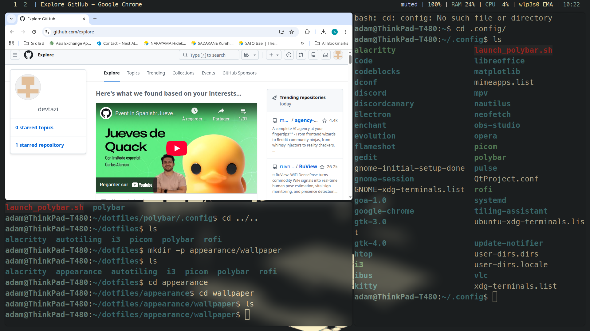
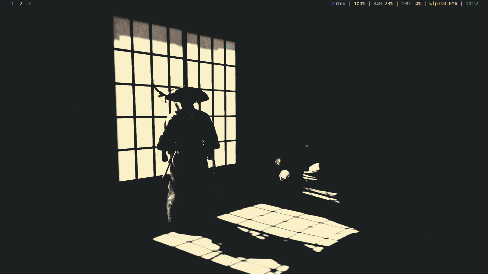

# 🐧 My Customized Linux Workflow

> A modular and automated environment deployment aimed at maximum productivity.

This repository contains my personal configuration files (dotfiles), managed with **GNU Stow**. This setup is designed for a fast, keyboard-centric workflow on i3wm.

---

## 📸 Preview

## 🛠️ Tech Stack

| Component | Choice |
| :--- | :--- |
| **Window Manager** | [i3-gaps](https://github.com/Airblader/i3) |
| **Status Bar** | [Polybar](https://github.com/polybar/polybar) |
| **Terminal** | Alacritty / Kitty |
| **App Launcher** | Rofi |
| **Dotfiles Manager** | GNU Stow |

---

## ⌨️ Key Features

- **Modular Structure:** Each application has its own directory (i3, polybar, appearance) for easy management and selective deployment.
- **Automated UI:** Consistent dark theme and visual harmony across GTK and Qt applications.
- **Productivity Focused:** Custom scripts for Polybar management and optimized workspace tiling to minimize mouse usage.
- **Rapid Deployment:** Entire environment can be restored on a fresh install in seconds using symlinks.

---
